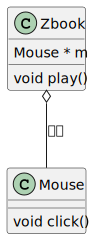

在尝试理解C++代码时，分析类与类之间的关系是非常重要的。类与类之间的关系有很多，比如依赖、关联、聚合、组合、继承、实现等等。本节主要介绍常用的三种关系：聚合、组合、继承。

# 聚合
聚合可以简单的理解为一个类含有另一个类的指针，这两个类对象的生命周期可能不同。用UML图表示如下：  


像下面代码中的 ``class Mouse`` 和 ``class Zbook``
```c++
class Mouse{
public:
  void click(){
    /* do some thing */
  }
};

class Zbook{
  Mouse *m;
  void play(){
    if(m != nullptr){
      m->click();
    }
  }
};
```

# 组合

# 继承
