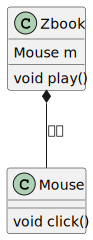
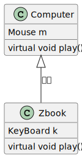

在尝试理解C++代码时，分析类与类之间的关系是非常重要的。类与类之间的关系有很多，比如依赖、关联、聚合、组合、继承、实现等等。本节主要介绍常用的三种关系：聚合、组合、继承。

# 聚合
聚合可以简单的理解为一个类含有另一个类的指针，即``has -a pointer``的概念。这两个类对象的生命周期可能不同。用UML图表示如下：  


像下面代码中的 ``class Mouse`` 和 ``class Zbook``
```c++
class Mouse{
public:
  void click(){
    /* do some thing */
  }
};

class Zbook{
  Mouse *m;
  void play(){
    if(m != nullptr){
      m->click();
    }
  }
};
```

# 组合
组合是``has-a``的概念，也就是一个类完全包含另一个类，组合一个类，你将具有那个类的全部功能。并且类的生命周期是一致的。


以下面的代码举例，``class Zbook``中有一个``class Mouse``的数据成员，当``class Zbook``构造时，会在其内部同时构造一个``class Mouse``，当``class Zbook``析构时，也会同时析构内部的``class Mouse``对象。
```c++
class Mouse{
public:
  void click(){
    /* do some thing */
  }
};

class Zbook{
public:
  Mouse m;
  void play(){
      m.click();
  }
};
```
# 继承
继承关系是一种更加复杂的关系，是实现面向对象特性中的继承特性的重要机制。可以将继承理解为``is-a``的概念。从底层内存中分析两个继承类的话，会发现他们的内存关系有点像组合的关系：派生类对象的内存中完整包含其基类对象内存。不同的是，派生类对象内存的头部会有一个虚指针，然后搭配虚函数和虚表可以实现运行时的多态特性。


```c++
class Computer{
public:
  Mouse m;
  virtual void play(){
    m.click();
  }
};

class Zbook : public Computer{
public:
  KeyBoard k;
  virtual void play(){
      m.click();
      k.hit();
  }
};
```

# 类对象内存布局分析工具
分析出类与类之间的关系，对于理解C++代码非常重要。在这里推荐一种类对象内存布局分析的方法。
1. 如果你使用的是g++编译器，可以通过g++指令中的``-fdump-lang-class``选项来打印文件中的类对象的内存分布，以及虚表的内容。
    ```bash
    g++ -fdump-lang-class -c hello_world.cpp
    ```
2. 如果用的是clang编译器，可以通过``clang -cc1 -fdump-record-layouts``和 ``clang -cc1 -fdump-vtable-layouts``来打印内存分布和虚表内容。
    ```bash
    clang -cc1 -fdump-record-layouts hello_world.cpp
    ```

    ```bash
    clang -cc1 -fdump-vtable-layouts hello_world.cpp
    ```
